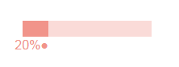

# HTML-Meter
### This library allows you to easily create awesome looking progress bars which can be easily customized with css.

#### Blue Theme

#### Blue Dark Theme

#### Red Theme

#### Yellow Theme

<br>
This library also comes with a progress indicator which can be aligned to top and bottom and turned on/off with your preference.
<br>
## Usage
<br>
First download the library from 
[Here](https://github.com/mukherjeesrijan2/HTML-Meter/archive/master.zip)
<br>
To use this library you first need to link the progress bar library to your HTML file.
<br>
```
<script type="text/javascript" src="<LOCATION TO THE JAVASCRIPT FILE"></script>
```