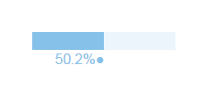
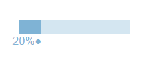

# HTML-Meter
### This library allows you to easily create awesome looking progress bars which can be easily customized with css.

#### Blue Theme

#### Blue Dark Theme

#### Red Theme

#### Yellow Theme

<br>
This library also comes with a progress indicator which can be aligned to top and bottom and turned on/off with your preference.
<br>
## Usage
<br>

**Including library to project**

<br>

First download this library.
<br>
To use this library you first need to link the progress bar library to your HTML file.

```html
<script type="text/javascript" src="<LOCATION OF THE JAVASCRIPT FILE>"></script>
```

### Creating progress bar
With this library you can turn a div element into a progress bar.
<br>
**Now, in order for this library to work with the div, the div needs to have an _id_ (recommended).**
<br>
To turn it (the div) into a progress bar, we will first make the div ready.
<br>
To do this we will use some attributes
<br>
* **data-elem** - This attribute makes the div element work as a progress bar.
* **max** - This is same as the attribute of the traditional progress bar. With this you set the max value of the progress. 
* **value** - This is also same as the attribute of the progress tag. With this you set the current progress value. 
* **meter(_optional_)** - This helps you set the visiblity of the meter. By Default its set to "_off_". But you can toggle it by setting the attribute value to "_on_"
* **meterPosition(_optional_)** - This helps you set the vertical position of the meter. By default its set to _up_ however you can change it to Down by changing the attribute value to _down_
<br>

#### Javascript
*After you load the library into your project or in your html file, it declares a _progressBAR_ object into global scope after the document is loaded*
<br>
That means, it can be accessed by using the *_window_* object only after the document is loaded.
<br>

*User available functions*
* **property** - Set property of the progress bar <br> **Syntax:** <br> _propery(object, element)_ <br> **Supported values in object:** <br> _meter_ - set meter _on_ / _off_ <br> **Example:**
```html
property ({meter: 'off'}, document.getElementById('id'))
```
* **theme** - Change theme of the progress bar <br> **Syntax:** <br> _theme(themename, element)_ <br> **Available themes:** <br> **default, orange, blue, green, purple, red, redDark, blueDark, deepBlue, yellow** <br> **Example:**
```html
theme ("blueDark", document.getElementById('id'))
```
* **changeValue** - Change value of the progress bar <br> **Syntax:** <br> _changeValue(value, element)_ <br> **Example:**
```html
changeValue (30, document.getElementById('id'))
```

**NOTE:** In the examples above, div with _id_ = **id** has been used.
<br>

### Example
#### HTML

```html
<!DOCTYPE html>
<html>
	<head>
		<title>Progress Bar Example</title>
		<script type="text/javascript" src="library/version 1.0/min/pbl-1.0.0.min.js"></script>
	</head>
	<body>
		<div id="progressBarElem" data-elem="progress" max="100" value="50" meter="on" meterPosition="down"></div>
	</body>
</html>
```

#### Javascript

```html
document.addEventListener("DOMContentLoaded", function () {
	var progressBarElem = document.getElementById("progressBarElem");

	// Change the value to 70
	window.progressBAR.changeValue(70, progressBarElem)

	// Change the theme to red
	window.progressBAR.theme('red', progressBarElem)

	// Turn off the meter
	window.progressBAR.property({meter: 'off'}, progressBarElem)
})
```

### Custom styling
<br>
What makes this library awesome is that they can be customized
<br>

##### Styling (CSS)
The container can be styled by just selecting it with its id or if you want to change style of all containers then use the class **_progress_** and a **_!important_** flag for **_display_**, **_width_**, **_background-color_**.
<br>
**Example (_with reference to the previous example_):**

```html
#progressBarElem {
	background-color: <SOME COLOR> !important;
}
```

**NOTE:** It is not recommended to change the height of the container, if you do so you also need to add some additional styles to keep everything properly aligned.

<br>

To change the color of the _bar_ (the part that moves)
<br>
Select the _bar_ class and set the _background-color_ with a _!important_ flag to change the global _bar_ color use the class _progress_ as the container.

**Example (_with reference to the previous example_):**

```html
#progressBarElem > .bar {
	background-color: <SOME COLOR> !important;
}
```

<br>

To change the color of the _meter_ (the number representation)
<br>
Select the _meter_ class and set the _color_ with a _!important_ flag to change the global _meter_ color use the class _progress_ as the container.

**Example (_with reference to the previous example_):**

```html
#progressBarElem > .bar > .meter{
	color: <SOME COLOR> !important;
}
```

**If you change the height of the conatiner**

***Apply the following styles***

```html
<container> .bar > .meter {
	bottom: <height of container>
}

<container> .bar .meterDown {
	top: <height of container>
}
```
<br>

### SUPPORT
<br>

**Found a bug?**

Please report to **mukherjeesrijan2@gmail.com**.