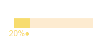

# HTML-Meter
### This library allows you to easily create awesome looking progress bars which can be easily customized with css.

#### Blue Theme

#### Blue Dark Theme

#### Red Theme

#### Yellow Theme

<br>
This library also comes with a progress indicator which can be aligned to top and bottom and turned on/off with your preference.
<br>
## Usage
<br>
### Including library to project
First download this library.
<br>
To use this library you first need to link the progress bar library to your HTML file.

```html
<script type="text/javascript" src="<LOCATION OF THE JAVASCRIPT FILE"></script>
```

### Creating progress bar
With this library you can turn a div element into a progress bar.
<br>
**Now, in order for this library to work with the div, the div needs to have an _id_.**
<br>
To turn it (the div) into a progress bar, we will first make the div ready.
<br>
To do this we will use some attributes
<br>
* **data-elem** - This attribute makes the div element work as a progress bar.
* **max** - This is same as the attribute of the traditional progress bar. With this you set the max value of the progress. 
* **value** - This is also same as the attribute of the progress tag. With this you set the current progress value. 
* **meter(_optional_)** - This helps you set the visiblity of the meter. By Default its set to "_off_". But you can toggle it by setting the attribute value to "_on_"
* **meterPosition(_optional_)** - This helps you set the vertical position of the meter. By default its set to _up_ however you can change it to Down by changing the attribute value to _down_
<br>

#### Javascript
*After you load the library into your project or in your html file, it declares a _progressBAR_ object into global scope after the document is loaded*
<br>
That means, it can be accessed by using the *_window_* object only after the document is loaded.
<br>

*User available functions*
* **property** - Set property of the progress bar <br> **Syntax:** <br> _propery(object, element)_ <br> **supported Values in object:** <br> _meter_ - set meter _on_ / _off_ <br> **Example:**
```html
property ({meter: 'off'}, document.getElementById('id'))
```
* **theme** - Change theme of the progress bar <br> **Syntax:** <br> _theme(themename, element)_ <br> **Available themes:** <br> **default, orange, blue, green, purple, red, redDark, blueDark, deepBlue, yellow** <br> **Example:**
```html
theme ("blueDark", document.getElementById('id'))
```
* **changeValue** - Change theme of the progress bar <br> **Syntax:** <br> _changeValue(value, element)_ <br> **Example:**
```html
changeValue (30, document.getElementById('id'))
```

**NOTE:** In the examples above, div with _id_ = *id* has been used.
<br>

```html
document.addEventListener("DOMContentLoaded", function () {
	window
})
```